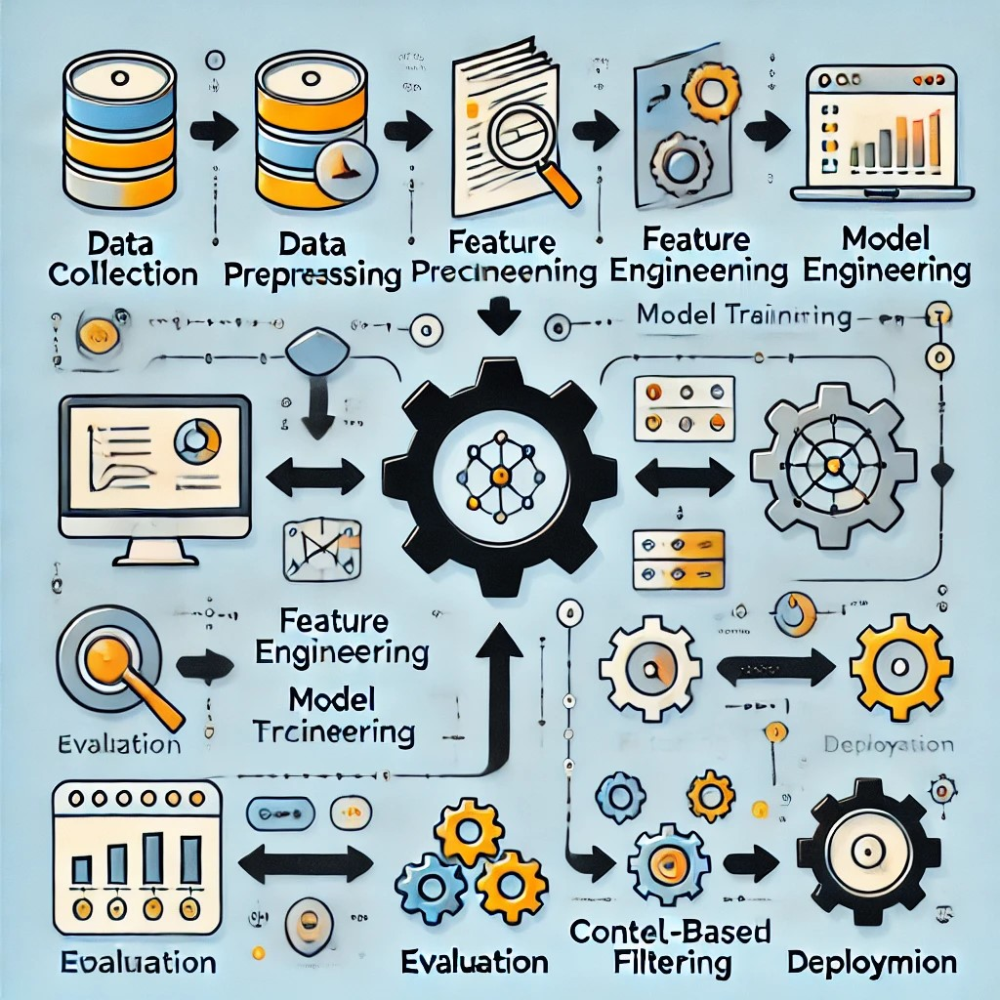

# GARE-ML-MODEL-
A machine learning engine that help you to find suitable Designing Agency.



### How to run locally
 - Go to project directory where you place your app.py
 - Open CMD and run the command
```
python app.py
```
